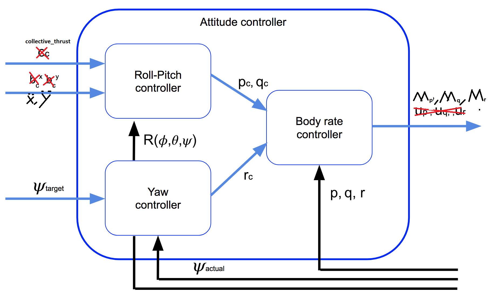
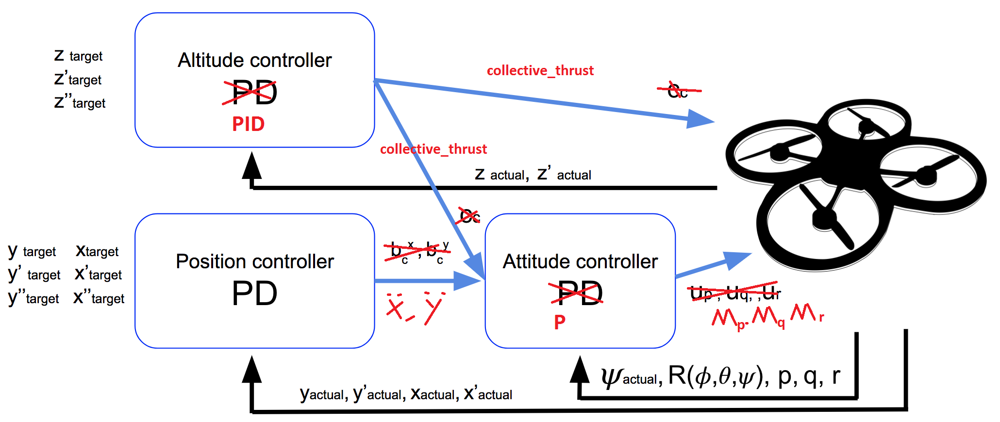
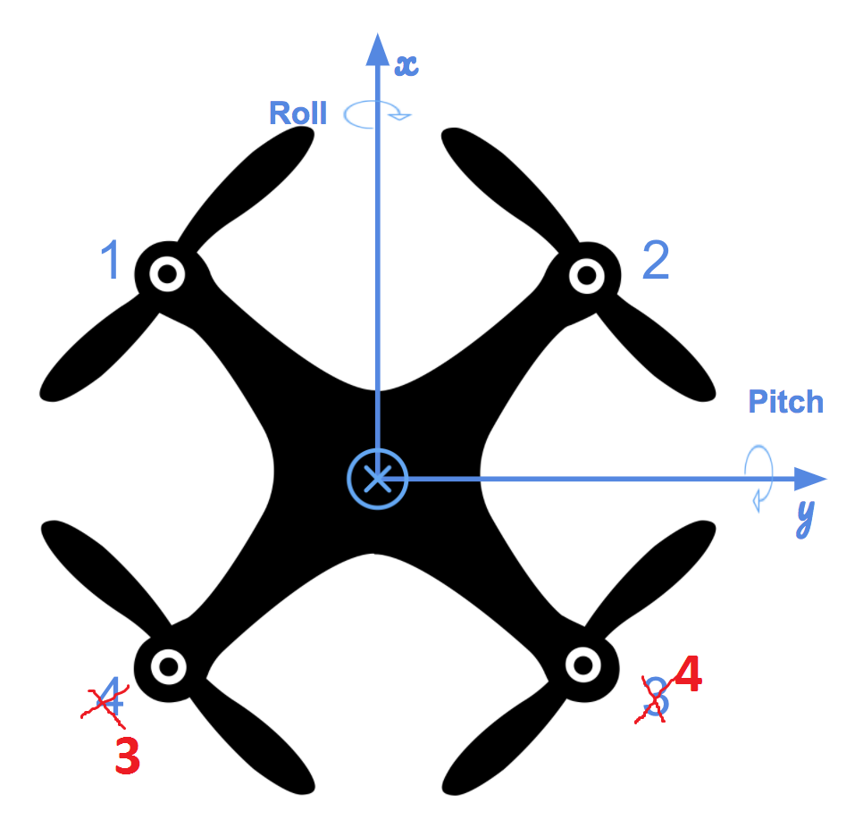

## Project: Building a Controller

---


# Required Steps for a Passing Submission:
1. Implemented body rate control in C++.
2. Implement roll pitch control in C++.
3. Implement altitude controller in C++.
4. Implement lateral position control in C++.
5. Implement yaw control in C++.
6. Implement calculating the motor commands given commanded thrust and moments in C++.
7. Flight Evaluation
8. Write it up.

## [Rubric](https://review.udacity.com/#!/rubrics/1643/view) Points
### Here I will consider the rubric points individually and describe how I addressed each point in my implementation.  

---
### Writeup
The whole C++ code implementing controll function is contained in source file `QuadController.cpp`, and the tuned parameters are contained in text file `QuadControlParams.txt`. In following text the source file and parameter file refer to above mentioned files.

#### Control Architecture
The control architecture is mainly based on architecture from lesson with small adaptation to input/output as well as to parameter conventions.

Here is the achitecture used in this project. The changes are explained in details by affected rubric points.


*Figure 1: Overall Control Architecture*


*Figure 2: Attitude Control*


#### 1. Implemented body rate control in C++. The controller should be a proportional controller on body rates to commanded moments. The controller should take into account the moments of inertia of the drone when calculating the commanded moments.

Body rate control is a propotional controller to instant detected error of reference value to measured value. See source code `line 95 - 115` in function:
```
V3F QuadControl::BodyRateControl(V3F pqrCmd, V3F pqr)

```


$Error_{\text{pqr}} or $\dot{p}\dot{p}\dot{r} is a angle acceleration in body frame. The output of  is required moment command for roll, pitch and yaw in body frame. So the  $\Error_{\text{pqr}} is multiplied by moment of inertia $I_{\text{xyz}}$. $I_{\text{xyz}}$ is read from parameter file `Ixx, Iyy,Izz`. The final output is $moment_cmd_{\text{pqr}}$ in body frame:

$$Error_{\text{pqr}} = kpPQR |times (pqrCmd - pqr)$$
$$moment_cmd_{\text{pqr}} = Error_{\text{pqr}} |times I_{\text{xyz}}$$


#### 2. Implement roll pitch control in C++. The controller should use the acceleration and thrust commands, in addition to the vehicle attitude to output a body rate command. The controller should account for the non-linear transformation from local accelerations to body rates. Note that the drone's mass should be accounted for when calculating the target angles.

Roll pitch controller is a propotional controller to instant detected error of reference value to measured value. See source code `line 118 - 158` in function:
```
V3F QuadControl::RollPitchControl(V3F accelCmd, Quaternion<float> attitude, float collThrustCmd)
```

The complexity of this function is it contains non-linear transformation of $\ddot{x}\ddot{y}$ acceleration command `accelCmd` in NED world frame to $pqr$ angular rate command `pqrCmd`in body frame by applying rotation matrix $R$ where:

$$R = R_z(\psi) \times R_y(\theta) \times R_x(\phi)$$

Here is the flow from input to output:

$$
\begin{align}
c = - collectiveThrust |divide mass \\  
\ddot{x}_{\text{command}} &=  c b^x_c \\
\ddot{y}_{\text{command}} &=  c b^y_c \\
b^x_c &= \ddot{x}_{\text{command}}/c
b^y_c &= \ddot{y}_{\text{command}}/c
$\dot{b}^x_c  = k_p(b^x_c - b^x_a)$
$\dot{b}^y_c  = k_p(b^y_c - b^y_a)$
\begin{pmatrix} p_c \\ q_c \\ \end{pmatrix}  = \frac{1}{R_{33}}\begin{pmatrix} R_{21} & -R_{11} \\ R_{22} & -R_{12} \end{pmatrix} \times \begin{pmatrix} \dot{b}^x_c \\ \dot{b}^y_c  \end{pmatrix} 
\end{align}
$$

Besides of applying the equation, one hint must be taken care of, the $c$ is converted from collective thrust divided by `mass`, since body frame has $z$ direction downwards, the thrust is however is measured upwards, $c$ value must be negated. 

#### 3. Implement altitude controller in C++. The controller should use both the down position and the down velocity to command thrust. Ensure that the output value is indeed thrust (the drone's mass needs to be accounted for) and that the thrust includes the non-linear effects from non-zero roll/pitch angles. Additionally, the C++ altitude controller should contain an integrator to handle the weight non-idealities presented in scenario 4.

Altitude controler is a *PID* controller. See source code `line 160 - 192` in function:
```
float QuadControl::AltitudeControl(float posZCmd, float velZCmd, float posZ, float velZ, Quaternion<float> attitude, float accelZCmd, float dt)
```

It follows the update equation:

$$\ddot{z}_{cmd} = k_{p-z}(z_{t} - z_{a}) + k_{d-z}(\dot{z}_{t} - \dot{z}_{a}) + k_{i-z} \sigma (z_{t} - z_{a})d_t  + \ddot{z}_t$$

$k_{p-z},k_{d-z}, k_{i-z}$ are read from parameters `kpPosZ`, `kpVelZ` and `KiPosZ`. The final output of altitude controller is collective thrust, therefore the  $\ddot{z}_{cmd}$ is mapped from world frame
to body frame by Rotation matrix. 

$$total_thrust = (mass |times *\ddot{z}_{cmd} + mass |times*g) / R_{33}$$

$R_{33}$ is a component from rotation matrix $R$.


#### 4. Implement lateral position control in C++. The controller should use the local NE position and velocity to generate a commanded local acceleration.

Lateral position controller is a *PD* controller. See code `line 195 - 226` in function:
```
V3F QuadControl::LateralPositionControl(V3F posCmd, V3F velCmd, V3F pos, V3F vel, V3F accelCmd)
```
It follows the update equation:
$$
\ddot{x}_{\text{cmd}} &=  k^x_p(x_t-x_a) + k_d^x(\dot{x}_t - \dot{x}_a)+ \ddot{x}_t \\
\ddot{y}_{\text{cmd}} &=  k^y_p(y_t-y_a) + k_d^y(\dot{x}_t - \dot{y}_a)+ \ddot{y}_t \\
$$

$k^x_p$, $k^y_p$ is read from parameter `kpPosXY`and $k_d^x,k_d^y$ is read from parameter `kpVelXY`. One hint in the code is to constrain the reference velocity in range `-maxSpeedXY,maxSpeedXY`. The output of Lateral position controller is just $\ddot{x}_{\text{cmd}}, \ddot{y}_{\text{cmd}}$ in NED world frame.


#### 5. Implement yaw control in C++. The controller can be a linear/proportional heading controller to yaw rate commands (non-linear transformation not required).

Yaw controller is a propotional controller to instant detected error of reference value to measured value. See code `line 229 - 249` in function:
```
float QuadControl::YawControl(float yawCmd, float yaw)
```

It follows the update equation:
$$
r_c = k_p (\psi_t - \psi_a)
$$

$k_p$ is read from parameter `kpYaw`. One attention to be paid is, the error $(\psi_t - \psi_a)$ shall be *fmod()* inside $0 ~ 2\pi$ range under assumption that yaw does not turn more than a round within $d_t$ sample cycle.


#### 6. Implement calculating the motor commands given commanded thrust and moments in C++. The thrust and moments should be converted to the appropriate 4 different desired thrust forces for the moments. Ensure that the dimensions of the drone are properly accounted for when calculating thrust from moments.

The motor commands are done by assining individual motor a thrust.  See code `line 58 - 89` in function:
```
VehicleCommand QuadControl::GenerateMotorCommands(float collThrustCmd, V3F momentCmd)
```

This depends on the layerout of rotors/frames and rotation direction. The starter code provides some hint on layout of motors as [Figure 3].



but the rotation of motors are not given. So there are 2 possibility and the corresponding matrix for distributing thrust is as following, which only affects the moment for yaw rate.

According to following transformation frome excercise in lesson:
$$
\begin{pmatrix} 1 & 1 & 1 & 1 \\ 1 & -1 & -1 & 1 \\ 1 & 1 & -1 & -1\\ 1 & -1 & 1 & -1 \end{pmatrix} \times \begin{pmatrix} \omega^2_1 \\ \omega^2_2 \\ \omega^2_3\\ \omega^2_4 \end{pmatrix} = \begin{pmatrix} \bar{c} \\ \bar{p} \\ \bar{q} \\ \bar{r} \end{pmatrix}
$$

or this, pay attention to last row.

$$
\begin{pmatrix} 1 & 1 & 1 & 1 \\ 1 & -1 & -1 & 1 \\ 1 & 1 & -1 & -1\\ <span style="color:red">-1 & 1 & -1 & 1 </span> \end{pmatrix} \times \begin{pmatrix} \omega^2_1 \\ \omega^2_2 \\ \omega^2_3\\ \omega^2_4 \end{pmatrix} = \begin{pmatrix} \bar{c} \\ \bar{p} \\ \bar{q} \\ \bar{r} \end{pmatrix}
$$

Here transformation matrix T:

$$
T=\begin{pmatrix} 1 & 1 & 1 & 1 \\ 1 & -1 & -1 & 1 \\ 1 & 1 & -1 & -1\\<span style="color:blue"> -1 & 1 & -1 & 1 </span> \end{pmatrix}
$$

We get moment for each motor is:

$$
\begin{pmatrix} \F_1 \\ \F_2 \\ \F_3\\ \F_4 \end{pmatrix} = T^{-1} \begin{pmatrix} c_cmd \\ p_cmd \\ q_cmd \\ r_cmd \end{pmatrix}
$$

Where 

$$
\begin{align}
c_cmd &= collective_thrust\\
p_cmd &= \frac{{M_p}{L}}\\
q_cmd &= \frac{{M_q}{L}}\\
r_cmd &= \frac{{M_r}{kappa}}\\
\end{align}
$$

$L$ is arm length, and $kappa$ is drag/thrust ratio and $T^{-1} is:
$\begin{pmatrix} 1 & 1 & 1 & -1 \\ 1 & -1 & 1 & 1 \\ 1 & 1 & -1 & 1\\ 1 & 1 & -1 & -1 \end{pmatrix} \times 0.25$


### Flight Evaluation
#### 7. Your C++ controller is successfully able to fly the provided test trajectory and visually passes inspection of the scenarios leading up to the test trajectory. Ensure that in each scenario the drone looks stable and performs the required task. Specifically check that the student's controller is able to handle the non-linearities of scenario 4 (all three drones in the scenario should be able to perform the required task with the same control gains used).

The controller with applied parameter passes all the scenarios. Here is the figure of scenario 5.


#### 8. Provide a Writeup / README that includes all the rubric points and how you addressed each one.  You can submit your writeup as markdown or pdf.  

You're reading it! 


